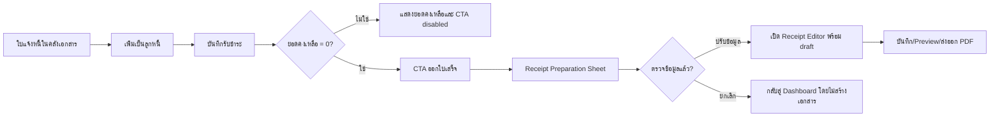

# UI/UX Design: ออกใบเสร็จจากรายการรับชำระที่ชำระครบ

**ผลิตภัณฑ์:** Tools Thai  
**สถานะ:** พร้อมยืนยันก่อนพัฒนา  
**ขอบเขตสัปดาห์นี้:** สร้างใบเสร็จฉบับร่างจากใบแจ้งหนี้ที่มีสถานะลูกหนี้ `paid` โดยใช้ข้อมูลที่บันทึกในระบบ ไม่กรอกข้อมูลซ้ำ และรักษา audit trail ของการรับชำระเดิม

## 1. เหตุผลที่เลือกฟีเจอร์นี้

Tools Thai มีเส้นทางทำงานที่ต่อเนื่องอยู่แล้ว ตั้งแต่สร้างใบแจ้งหนี้ บันทึกลูกหนี้ รับชำระบางส่วนหรือครบจำนวน และตรวจดู timeline ได้ ฟีเจอร์ที่ควรเชื่อมต่อในสัปดาห์นี้คือ **การออกใบเสร็จหลังชำระครบ** เพราะช่วยปิดวงจรงานของผู้ประกอบการโดยไม่บังคับให้กลับไปกรอกชื่อลูกค้า รายการสินค้า หรือยอดเงินซ้ำอีกครั้ง

> เป้าหมาย UX คือให้ผู้ใช้เปลี่ยนจาก “ได้รับเงินครบแล้ว” เป็น “มีใบเสร็จฉบับร่างพร้อมตรวจและส่งออก” ภายในสามการกระทำหรือน้อยกว่า

| ปัญหาปัจจุบัน | แนวทางออกแบบ | ผลลัพธ์ที่คาดหวัง |
|---|---|---|
| ผู้ใช้ต้องเริ่มใบเสร็จใหม่และกรอกข้อมูลซ้ำ | ดึงข้อมูลจาก invoice และ receivable ที่เป็นเจ้าของเดียวกัน | ลดข้อผิดพลาดของยอด ลูกค้า และเลขอ้างอิง |
| การออกใบเสร็จก่อนชำระครบทำให้เอกสารไม่ตรงสถานะ | แสดง CTA เฉพาะสถานะ `paid` และอธิบายเหตุผลกรณี disabled | ลดความสับสนเรื่องเอกสารและเงินคงค้าง |
| การแก้ไข/void payment ต้องตรวจย้อนหลังได้ | เก็บ source invoice, receivable และ active payment IDs ใน metadata ของใบเสร็จ | ทีมงานตรวจที่มาของเอกสารได้ในภายหลัง |

## 2. ผู้ใช้และงานหลัก

ผู้ใช้หลักคือเจ้าของธุรกิจหรือผู้ดูแลบัญชีที่บันทึกการรับชำระในหน้า **ติดตามรับชำระ** แล้วต้องสร้างหลักฐานรับเงินให้ลูกค้า งานหลักไม่ใช่การออกเอกสารจากหน้าว่าง แต่เป็นการยืนยันรายละเอียดที่ระบบเตรียมไว้และปรับข้อความสั้น ๆ ก่อนส่งออก PDF

| User story | เกณฑ์ความสำเร็จ |
|---|---|
| ในฐานะผู้ดูแลบัญชี ฉันต้องการออกใบเสร็จจาก invoice ที่ชำระครบ เพื่อไม่ต้องกรอกข้อมูลเดิมอีก | เอกสารฉบับร่างมีลูกค้า รายการสินค้า ยอดรวม และเลข invoice อ้างอิงครบ |
| ในฐานะเจ้าของกิจการ ฉันต้องการเห็นว่ารายการใดออกใบเสร็จได้ เพื่อไม่สร้างเอกสารผิดสถานะ | CTA ปรากฏเฉพาะ `paid`; สถานะอื่นแสดงคำอธิบายที่ชัดเจน |
| ในฐานะผู้ตรวจสอบ ฉันต้องการทราบว่ารายการชำระใดรองรับใบเสร็จ | มี metadata และ activity event ที่เชื่อม invoice/receivable/active payments แบบ owner-scoped |

## 3. Information Architecture และจุดเริ่มต้น

ผู้ใช้เข้าฟีเจอร์เดียวกันได้จากสามบริบท แต่ทุกจุดนำไปสู่ **Receipt Preparation Sheet** เดียวกัน เพื่อลดรูปแบบการตัดสินใจซ้ำและคงความคุ้นเคยของหน้าเอกสารเดิม

| จุดเริ่มต้น | เงื่อนไข | CTA หลัก | พฤติกรรมหลังคลิก |
|---|---|---|---|
| แถวใน Receivables Dashboard | `status = paid` | `ออกใบเสร็จ` | เปิด Receipt Preparation Sheet |
| Success state หลังบันทึก payment สุดท้าย | ยอดคงเหลือกลายเป็น ฿0.00 | `สร้างใบเสร็จตอนนี้` | เปิด Sheet ทันที โดยไม่ปิด detail modal ก่อน |
| Drawer รับชำระใน Document Center | invoice เชื่อม receivable ที่ `paid` | `ออกใบเสร็จจากการชำระนี้` | เปิด Sheet พร้อมข้อมูลเอกสารต้นทาง |

สำหรับรายการที่ยังไม่ชำระครบ ให้แสดงปุ่มแบบ secondary ที่ disabled พร้อม tooltip ว่า **“ออกใบเสร็จได้เมื่อยอดคงเหลือเป็น ฿0.00”** ไม่ควรซ่อนตำแหน่งฟีเจอร์ทั้งหมด เพราะผู้ใช้ยังได้เรียนรู้เงื่อนไขที่ถูกต้องโดยไม่ถูกขัดจังหวะ

## 4. User Flow

### 4.1 Receipt Preparation Sheet

เมื่อคลิก CTA ระบบไม่สร้างเอกสารถาวรทันที แต่เปิด sheet ทางขวาบน desktop และ bottom sheet เต็มความกว้างบน mobile เพื่อให้ผู้ใช้ตรวจ source ก่อน ขั้นตอนนี้ลดเอกสารร่างที่ไม่ตั้งใจ และทำให้สถานะทางการเงินไม่ถูกแก้ไขจากการออกใบเสร็จ

| ส่วนประกอบ | เนื้อหา | การตัดสินใจ UX |
|---|---|---|
| Header | `เตรียมออกใบเสร็จ` พร้อมเลข invoice และปุ่มปิด | ใช้คำกริยาที่ชัดเจน ไม่ใช้ “Create document” |
| Completion Banner | ไอคอน check, “ชำระครบแล้ว”, ยอดรับสุทธิ | สี deep teal อ่อน ไม่ใช้สีเขียวสดที่ดึงความสนใจเกินจำเป็น |
| Document Summary | ลูกค้า, วันที่ invoice, ยอด invoice, เลขอ้างอิง | อ่านอย่างเดียว เพื่อย้ำว่าเป็นข้อมูลต้นทาง |
| Payment Summary | วิธีชำระ, วันที่รับเงิน, ยอดรวม และจำนวน active payments | หากมีหลายวิธี แสดง `รับชำระ 3 รายการ` แล้วเปิดรายละเอียดแบบ expand ได้ |
| Receipt Defaults | วันที่ใบเสร็จ, เลขใบเสร็จที่ระบบเสนอ, หมายเหตุ | แก้ได้ใน editor ถัดไป ไม่ควรบังคับให้แก้ใน sheet |
| Primary CTA | `เปิดฉบับร่างใบเสร็จ` | สร้าง draft ฝั่ง server แล้วส่งผู้ใช้สู่ editor |
| Secondary CTA | `ยังไม่ออกตอนนี้` | ปิด sheet โดยไม่บันทึก draft |

### 4.2 Receipt Editor Handoff

หลังยืนยัน ให้เปิด `/receipt` พร้อม session resume ที่มี payload ของใบเสร็จ ระบบแสดง toast แบบไม่ขัดจังหวะว่า **“สร้างใบเสร็จฉบับร่างจาก IV-XXXX แล้ว ตรวจรายละเอียดก่อนส่งออก PDF”** แถบ source context เหนือ editor แสดง `อ้างอิงใบแจ้งหนี้ IV-XXXX · รับชำระครบเมื่อ 27 ส.ค. 2569` พร้อมลิงก์กลับไปยัง Dashboard รับชำระ

ข้อมูลใน editor ต้องยังแก้ไขได้ตาม workflow เอกสารปัจจุบัน แต่ข้อมูลความสัมพันธ์ทางการเงินไม่ควรถูกแก้จาก editor หากต้องเปลี่ยนยอดรับชำระ ผู้ใช้ต้องกลับไปใช้ payment replacement/void เพื่อให้ timeline ถูกต้อง

## 5. Layout Specification

### Desktop: 1280px ขึ้นไป

หน้ารายละเอียดรับชำระคง layout ปัจจุบัน และวาง CTA `ออกใบเสร็จ` ถัดจากสถานะ `ชำระครบ` ในตำแหน่ง action area เดิม Sheet กว้าง 440–480px เลื่อนเฉพาะเนื้อหาด้านใน ส่วน Dashboard ด้านหลังถูก dim 24% และไม่เลื่อนขณะ sheet เปิด

| ลำดับสายตา | องค์ประกอบ | น้ำหนักการมองเห็น |
|---|---|---|
| 1 | Completion Banner และยอดสุทธิ | ตัวเลข DM Sans 24px, deep teal |
| 2 | เลข invoice / ชื่อลูกค้า | 16px semibold, ink |
| 3 | ตาราง payment summary | 13px, line height 1.5 |
| 4 | CTA เปิดฉบับร่างใบเสร็จ | ปุ่ม deep teal เต็มความกว้าง |
| 5 | Cancel action | text button สี muted |

### Mobile: 375px

CTA แสดงเต็มความกว้างใต้ยอดคงเหลือเมื่อชำระครบ Bottom sheet ใช้ความสูงไม่เกิน 88vh, มี drag handle และปุ่ม close ที่เข้าถึงได้ด้วย keyboard การ์ดสรุปเรียงหนึ่งคอลัมน์; รายการ payment มากกว่าสองรายการยุบเป็น accordion เพื่อไม่ให้ primary CTA หลุดจากพื้นที่มองเห็น

## 6. States, Validation และ Feedback

| สถานะ | สิ่งที่ผู้ใช้เห็น | การทำงานของระบบ |
|---|---|---|
| ยังไม่ชำระครบ | CTA disabled + tooltip พร้อมยอดที่เหลือ | ไม่เรียก API สร้าง receipt |
| ชำระครบ / ไม่มี receipt | CTA active | เตรียม source summary จาก owner-scoped API |
| กำลังสร้าง draft | ปุ่ม loading: `กำลังเตรียมใบเสร็จ...` และป้องกัน double click | สร้าง document ใน transaction เดียว |
| มี receipt draft อยู่แล้ว | แสดง `เปิดใบเสร็จฉบับร่าง` และเวลาล่าสุด | ไม่สร้าง document ซ้ำโดยอัตโนมัติ |
| payment ถูก void หลังเปิด sheet | inline error: `ข้อมูลการรับชำระเปลี่ยนแปลง กรุณาตรวจอีกครั้ง` พร้อมปุ่ม refresh | ยกเลิก handoff ที่เก่า ไม่แก้ payment data |
| API/network error | error card พร้อม retry | คง sheet และข้อมูลที่ผู้ใช้กำลังดู |

## 7. Data และ API Contract ที่เสนอ

API ทุกตัวเป็น `protectedProcedure` และใช้ `ctx.user.id` เป็น owner boundary ฝั่ง client ส่งเพียง `receivableId`; ฝั่ง server ตรวจว่า invoice, receivable, payments และ receipt draft อยู่ภายใต้เจ้าของเดียวกันเสมอ

| Procedure | Input | Output / หน้าที่ |
|---|---|---|
| `receivables.getReceiptEligibility` | `receivableId` | สถานะ paid, source invoice, active payments, existing receipt draft, reason หากออกไม่ได้ |
| `receivables.createReceiptDraft` | `receivableId` | บันทึก/คืน `receiptDocumentId`, payload, `sourceInvoiceNumber` และ resume key |
| `documents.get` | `documentId` | ใช้เปิดใบเสร็จ draft ที่มีอยู่ โดย owner-scoped |

metadata ของ receipt draft ควรมี `sourceInvoiceId`, `sourceReceivableId`, `activePaymentIds`, `paymentTotalAtCreation` และ `createdFrom = "receivable-paid"` ข้อมูลนี้ใช้สำหรับแสดง source context และ audit เท่านั้น โดยห้าม client เขียนทับ ID เหล่านี้เอง

## 8. Visual Language และ Accessibility

การออกแบบใช้ warm paper `#F8F5ED` เป็นพื้น, deep teal เป็น action ที่เปลี่ยนสถานะ, navy/ink สำหรับข้อความหลัก และ terracotta เฉพาะ warning/error Completion Banner ใช้ icon และข้อความร่วมกันเสมอ จึงไม่พึ่งสีเพียงอย่างเดียว ปุ่มทุกปุ่มมี focus ring, sheet มี `role="dialog"`, `aria-modal="true"`, focus trap และคืน focus ไป CTA เดิมเมื่อปิด

motion ใช้เพียง slide/fade ของ sheet ระยะ 220ms ด้วย ease-out; การเปลี่ยนสถานะที่สำคัญแสดงผลทันทีสำหรับผู้ใช้ keyboard และต้องปิด motion ที่ไม่จำเป็นเมื่อเปิด `prefers-reduced-motion`

## 9. Acceptance Criteria ที่ตรวจได้

| หมวด | เงื่อนไขผ่าน |
|---|---|
| Eligibility | CTA active เฉพาะ receivable ที่ยอดคงเหลือ 0 และไม่ cancelled |
| Source integrity | ลูกค้า รายการสินค้า ยอด invoice และ active payments ถูกอ่านจาก server ด้วย owner scope |
| Duplicate prevention | การกด CTA ซ้ำระหว่าง pending ไม่สร้าง draft ซ้ำ และ draft เดิมเปิดซ้ำได้ |
| Audit safety | void/replacement หลังสร้าง draft ไม่ลบ receipt; source context แจ้งว่าข้อมูลรับชำระเปลี่ยนเมื่อเปิดใหม่ |
| Accessibility | Keyboard เปิด/ปิด sheet ได้, focus ไม่มีทางหลุด และ error/success ประกาศผ่าน live region |
| Responsive | Desktop sheet และ mobile bottom sheet ใช้งานได้ที่ 1280px และ 375px |
| Regression | `pnpm check`, `pnpm test`, `pnpm build` และ browser fixture ของ receipt handoff ผ่านร่วมกับ Module 1/2 |

## 10. แผนพัฒนาสัปดาห์นี้

| วัน | Deliverable | หลักฐานตรวจรับ |
|---|---|---|
| วัน 1 | Schema/owner-scoped eligibility contract และ test | migration review, unit/router tests |
| วัน 2 | Receipt Preparation Sheet จาก Dashboard และ Document Center | desktop browser QA |
| วัน 3 | สร้าง/เปิด receipt draft, resume handoff และ source context ใน editor | browser QA + duplicate guard |
| วัน 4 | Accessibility, mobile bottom sheet, error/void-change states | mobile screenshots + keyboard QA |
| วัน 5 | Regression, build, checkpoint และสรุปวิธีใช้ | Vitest/build/browser evidence |

## 11. ขอบเขตที่ไม่รวมในรอบนี้

รอบนี้ไม่สร้างใบกำกับภาษีอัตโนมัติ, ไม่ส่ง email, ไม่สร้าง receipt จาก partial payment และไม่เปลี่ยนข้อมูลการรับชำระจาก receipt editor ความสามารถเหล่านี้ควรต่อยอดหลังตรวจว่าการออกใบเสร็จจากการชำระครบมีการใช้งานถูกต้องและ audit trail สอดคล้องกับงานจริง
